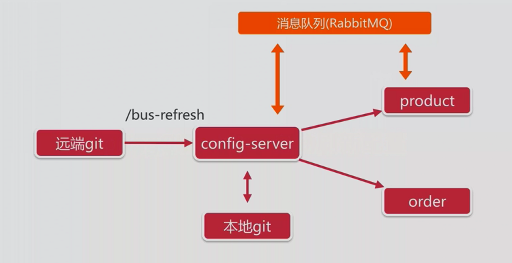

`/{label}/{name}--{profiles}.yml`
- name 服务名
- profiles 环境
- label 分支（branch）

eg:order-dev.yml 会匹配 order-dev.yml
如果同时存在order.yml、order-dev.yml,访问order-dev.yml则会合拼order.yml、order-dev.yml的内容

### SpringCloud Bus 实现动态刷新

#### 注意点
- 如果eureka配置端口不是8761,并且客户端在application.yml里没有配置eureka地址则无法拉取到github上的配置文件，会去拉去默认地址
  localhost:8888
- 项目启动时会先找数据库配置文件，所以需要创建bootstrap.yml文件，修改启动顺序  
- @RefreshScope// 使用该注解的类，会在接到SpringCloud配置中心配置刷新的时候，自动将新的配置更新到该类对应的字段中
