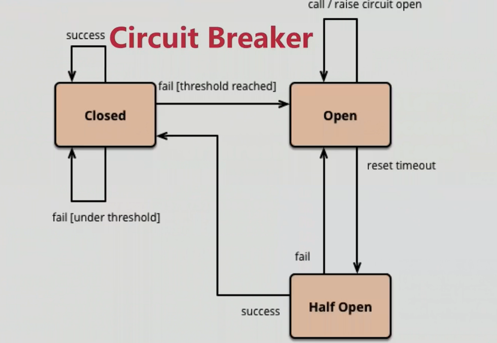

## Spring Cloud Hystrix
- 防雪崩利器
- 基于Netflix对应的Hystrix

### 功能
- 服务降级
  - 优先核心业务，非核心服务不可用或弱可用
  - 通过HystrixCommand注解指定
  - fallbackMethod（回退函数）中具体实现降级逻辑
- 依赖隔离
  - 线程池隔离
  - Hystrix自动实现了依赖隔离
- 服务熔断
  - Circuit Breaker 熔断器
- 监控（Hystrix Dashboard)

### 熔断状态机
当熔断器Open时，所有的服务都返回错误；
状态机有一个时钟选项，当到达时钟时间是，状态机为Half Open；
